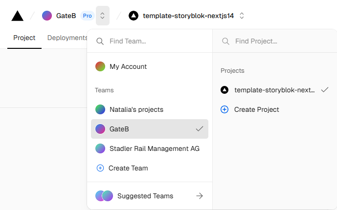
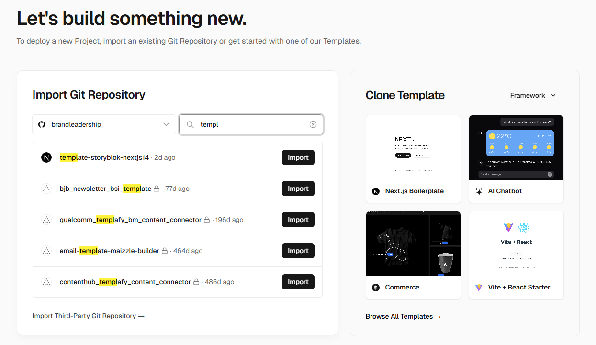
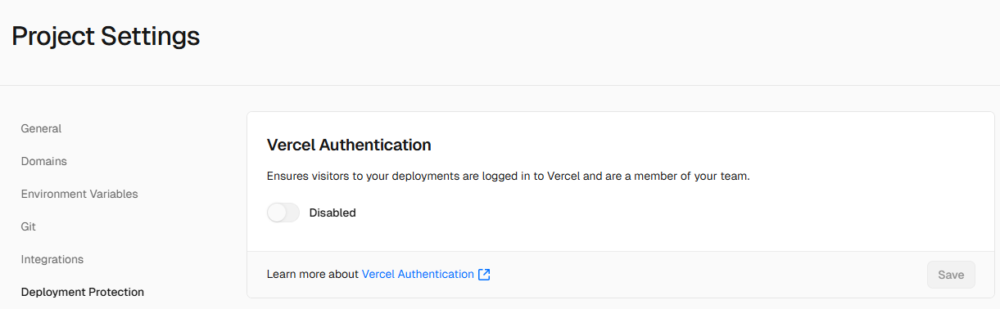
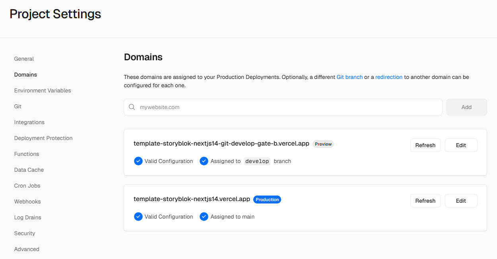
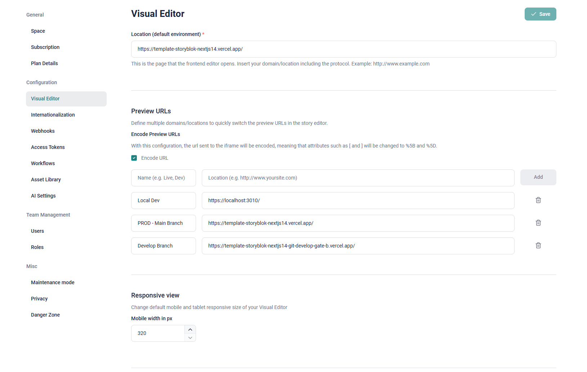

# Template for Storyblok & Next JS 14 Setup

This Repository serves as a Template for new Storyblok Projects. It has all of the initial configuration for a:

-   Storyblok Space based on the Template Space available in the Partner Portal
-   Next.JS, React & Typescript Stack
-   Vercel for Deployment and Hosting

> To create a new Project, please use the "Use as a Template" Button on the Github Repository to create a new Repository based on this Template Setup. No project specific work should be done in this project.

## Local Setup

### Installation

In order to work on this repository on your local machine, follow these steps:

1. **Install project setup**  
   Clone repository and run `npm i` to set up the Project locally.
   ❗Make sure you only do that when you want to work on this template, not on a project.

2. **Install Storyblok CLI globally**  
   Run the following command to install the Storyblok CLI globally on your machine:

    `npm i -g storyblok`

3. **Set up Proxy**
   Run ...

<details>
<summary>Working with Types</summary>

Link to the Docs https://www.storyblok.com/faq/how-can-i-utilize-typescript-in-my-storyblok-project

This guide will walk you through setting up Storyblok CLI, pulling component schemas, and generating TypeScript types for your project.

### Steps

1. **Log in to Storyblok**  
   Open your terminal and log in to your Storyblok account by running `storyblok login`. Use the credentials you are using for your Storyblok account.

2. **Download the schema**  
   In your project directory, download the schema of your Storyblok components into a `.json` file by running:

    `storyblok pull-components --space SPACE_ID (your space id)`

    It is recommended to add this command to the scripts section of your package.json, e.g. under the identifier pull-sb-components.

3. **Generate TypeScript types**  
   In your project directory, generate TypeScript types based on the downloaded schema by running:

    `storyblok generate-typescript-typedefs --sourceFilePaths ./components.SPACE_ID.json --destinationFilePath ./component-types-sb.d.ts.`

    It is recommended to add this command to the scripts section of your package.json, e.g. under the identifier generate-sb-types.

4. **Import the type in each component**  
   Import the type in each component, for example: import type { PageStoryblok } from '../component-types-sb' or from types folder and file.

### ⚠️ Important

> **Remember to rerun the `pull-sb-components` and `generate-sb-types` scripts after you've made changes to your component schema in your Storyblok space.**

</details>

<details>
<summary>Working with Sitemaps</summary>

First, install the `next-sitemap` package:

Run `npm install next-sitemap` or `npm install` if it's already installed by another developer, which it is in this project.

### next-sitemap.config.js

```js
module.exports = {
    siteUrl: 'https://www.yourdomain.com', // Change to your site URL
    generateRobotsTxt: true, // (optional)
    // ...other options
};
```

### package.json

To create a new Sitemap, the new script was added to the package.json, you could simply run `npm run postbuild` to create a new Sitemap.

```json
"scripts": {
"postbuild": "next-sitemap"
}
```

### Additional Commands

`npm run build`

`npx next-sitemap --config ./next-sitemap.config.js`

`npx next-sitemap (preview it locally)`

**[Link to documentation!](https://www.npmjs.com/package/next-sitemap)**

> **Important Note:** !!! Add languages according to the needs of the project.

</details>

## Setup for a new Project

1. Duplicate existing Template Space in the Storyblok Partner Portal. This will take over all existing configurations and blocks. Make sure you select the "Development Plan".
2. In Github, create a new repository based on this one by clicking the "Use as a Template" button.
3. Head over to Vercel (make sure you're in the GateB Team), create a new Project and choose the correct Github repository. Add the Environment variable from Storyblok.
4. For the local development setup, in Storyblok > Settings > Visual Editor, in Location (default environment), change the value to `https://localhost:3010/`. Add the other Preview links as soon as you've set them up in Vercel.
5. Install and set up 'Vercel Deployments' App in Storyblok and connect it with Vercel Project.
6. In the Vercel Settings, you can also add a new Domain based on the Branch Domains to have a Dev and a Prod Environment.


## Vercel Set Up

### Installation

In order to work on this repository on your local machine, follow these steps:

1. **Create Project in Vercel**  
   Choose the correct team where you would like to have the project and click "Create Project"
   

2. **Import Github Repo**  
   Import the Github Repo that will be connected to the Vercel deployments. 
   On the next step type the Project Name and choose deploy. Root Directory and Framework Preset will be prefilled, so usually no additinal settings are required.
   

3. **Deployment Running**  
   When the project build is deployed you will receive the "Congratulations" message.
   If `npm run build` is failed you will have to fix the problems to see the preview.
   The next step would be to click "Continue to Dashboad". 
   Congratulations! Our vercel deployments from Github are set up. Now every push will cause a deployment in Vercel and you will be able to preview the changes.

3. **Vercel Settings for Storyblok Preview**  
   To enable Storyblok access to the different branches in Vercel you should go to Project Dashboard > Settings > Deployment Protection > Vercel Authentication and disable the switcher:
   
   Then go to Project Dashboard > Settings > Domains. Here you will see the main domain present by default. To enable 1 or more develop previews accessable via Storyblok add them as separate domains. The link to add you can find in deployments. If the branch was ever deployed in Vercel it has a domain assigned by Vercel. 
   The suggestion will be to add 1 domain in settings for develop branch as a Preview:
   

4. **Set up Previews in Storyblok**  
   Go to the Storyblok admin panel: Settings > Visual Editor.
   Here you have to set up visual editor links for you project. Base requirements will be covered by 3 links:
   Local Dev - https://localhost:3010/ - the preview for local build for developers.
   Main Branch - YOUR_LINK_TO_VERCEL_MAIN_BRANCH_DEPLOYMENT - the preview for main stable branch and production site (if the site is live), for managers' and content editors' usage.
   Develop Branch - YOUR_LINK_TO_VERCEL_DEVELOP_BRANCH_DEPLOYMENT - the preview for develop branch, should be used for testing features before pushing them to production.
   


