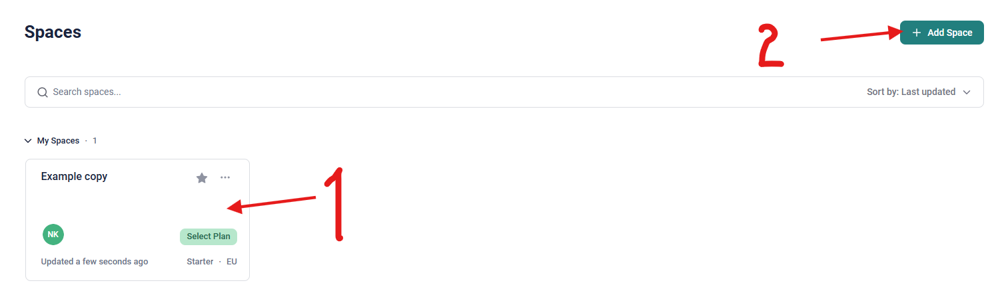
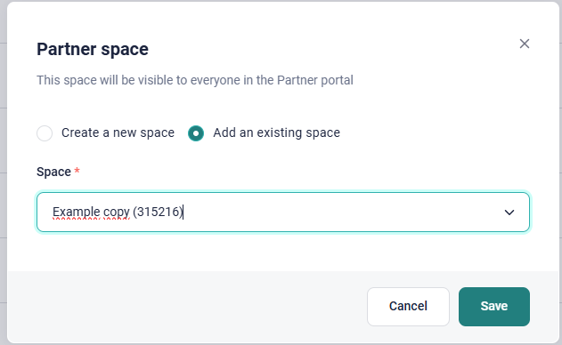
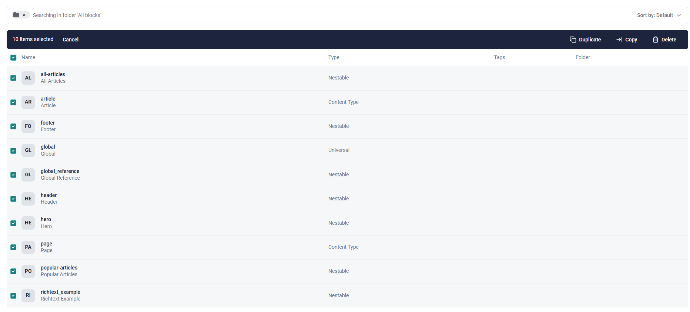
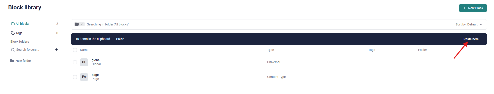

## Initial Project Installation

This instruction describes how to perform a full set up of a project base on templates. Therefore we have 2 templates to install:

1. Github NextJS 14 Template
2. Storyblok Space Template

We will work with templates because it is much quicker, but in case you want to set up Storyblok Space from scratch please check `STORYBLOK_COMPONENTS.md` file. There you can find a description of how to create components in Storyblok to match the structure of our Github Project.

### Create a New Repo with the Template

1. **Click on the button "Use this template"**

    

2. **Enter the details for your project.**

    Preferably don't choose "Include all branched" as the main branch is stable and should be used as a template for creation.

    

3. Now you should have a new repo for your project initialised. This project has typescript, default components, eslint/prettier, tailwind and prepared code for Vercel and Storyblok, but if you try to run the project locally it will not work.
   Pay attantion that this project has not Storyblok or Vercel connections, no branches protection or CI/CD checks implemented.
   We will cover all these moment in the nxt steps.

### Duplicate Template Storyblok Space

1. **Duplicate the Space in Storyblok**

Choose the `NextJS-14` Project in Storyblok Dashboard, it is our template project with the set up that matches the structure of the Github template. This will take over all existing configurations and blocks. Make sure you select the "Development Plan".

2. **Enter Your Name**

3. **Add New Partner's Project**

By default your duplicated space will be added to your projects in "My Spaces" section. To make is not only your project, but one of the Partner's Projects please click the button "Add Space" and choose "Partner Space" and then "Add an existing Space", and add the space you has recently duplicated.

4. **Copy the Blocks**

Because the space is copied without content blocks we need to copy them separately. To do that go to the template project, in our case to NextJS-14, open Block Library, choose all the blocks and press "Copy"

Then go to the Block Library in your freshly created project and press "Paste here". If you don't see this button most likely the components were not copied correctly, so please repeat the previous step.

Great, now we are ready to connect out Storyblok project to the codebase.

### Connect Storyblok to the Github Project

Go to Storyblok settings in your project: Settings > Access token.
Here you should from the beginning have a token with the Access level "Preview". If you dont have generate one for "Preview".

Copy the token value and replace the example value of `NEXT_PUBLIC_STORYBLOK_ACCESS_TOKEN` in `.env` file.
It will allow our project to have access to the Storyblok space and retrieve data.

### Run the Project Locally

1. **Install packages**  
   Clone repository and run `npm i` to set up the Project locally.

2. **Install Storyblok CLI globally**  
   Run the following command to install the Storyblok CLI globally on your machine:

    `npm i -g storyblok`

3. **Start Proxy**

    Run the proxy to have a preview in Storyblok

    `npm run proxy`

4. **Start the Project**

    Run the following command to preview the project locally on your machine:

    `npm run dev`

    You project should run on `http://localhost:3000/`

### Next Steps

**To complete the initial template set up please follow the instructions in the documents below**

1. `TYPESCRIPT.md`
2. `VERCEL.md`
