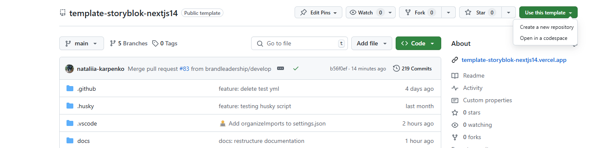
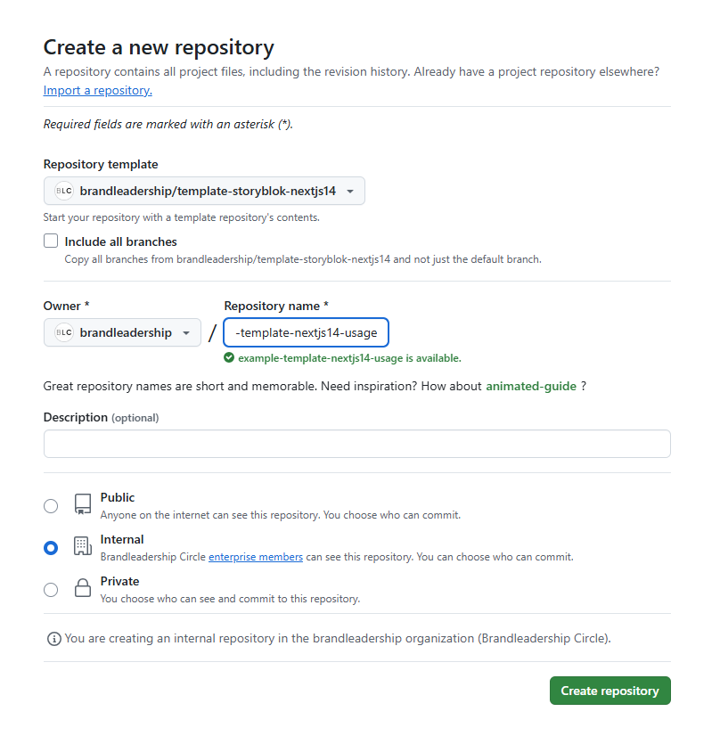
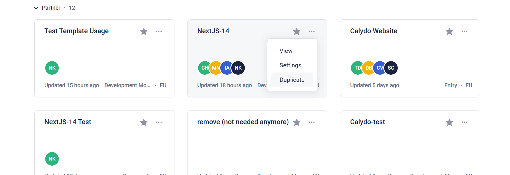
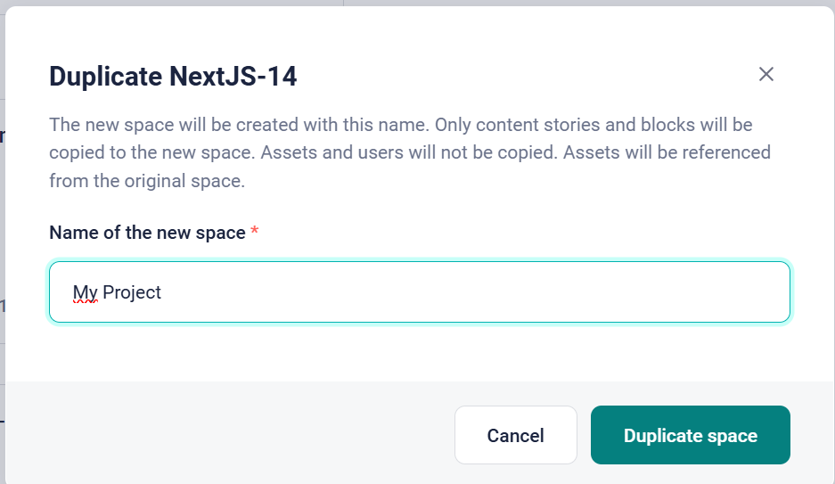
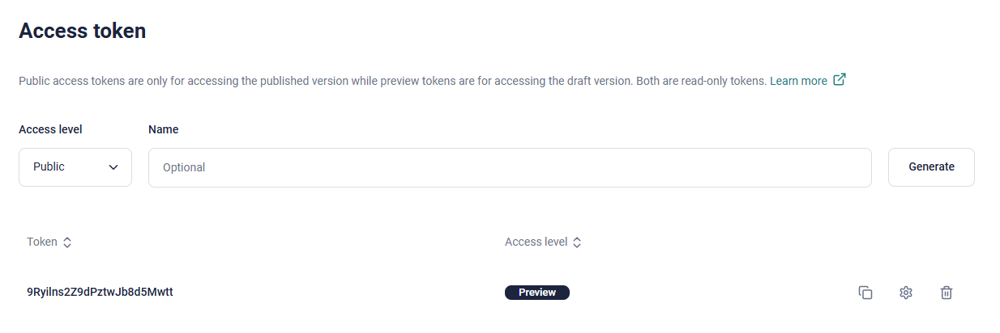

## Initial Project Installation

This instruction describes how to perform a full set up of a project base on templates. Therefore we have 2 templates to install:

1. Github NextJS 14 Template
2. Storyblok Space Template

We will work with templates because it is much quicker, but in case you want to set up Storyblok Space from scratch please check `STORYBLOK_COMPONENTS.md` file. There you can find a description of how to create components in Storyblok to match the structure of our Github Project.

### Create a New Repo with the Template

1. **Click on the button "Use this template"**

    

2. **Enter the details for your project.**

    Preferably don't choose "Include all branched" as the main branch is stable and should be used as a template for creation.

    

3. Now you should have a new repo for your project initialised. This project has typescript, default components, eslint/prettier, tailwind and prepared code for Vercel and Storyblok, but if you try to run the project locally it will not work.
   Pay attantion that this project has not Storyblok or Vercel connections, no branches protection or CI/CD checks implemented.
   We will cover all these moment in the nxt steps.

### Duplicate Template Storyblok Space

1. **Duplicate the Space in Storyblok**

Choose the `NextJS-14` Project in Storyblok Dashboard, it is our template project with the set up that matches the structure of the Github template. This will take over all existing configurations and blocks. Make sure you select the "Development Plan".

1. **Enter Your Name**

### Connect Storyblok to the Github Project

Go to Storyblok settings in your project: Settings > Access token.
Here you should from the beginning have a token with the Access level "Preview". If you dont have generate one for "Preview".

Copy the token value and replace the example value of `NEXT_PUBLIC_STORYBLOK_ACCESS_TOKEN` in `.env` file.
It will allow our project to have access to the Storyblok space and retrieve data.
