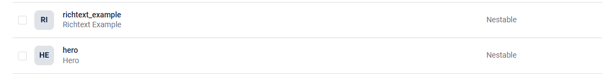
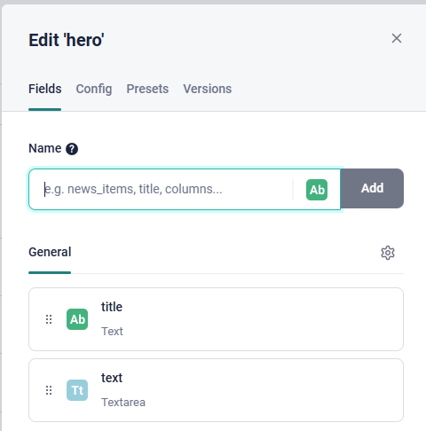
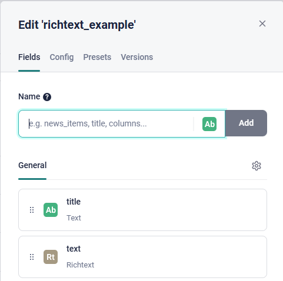
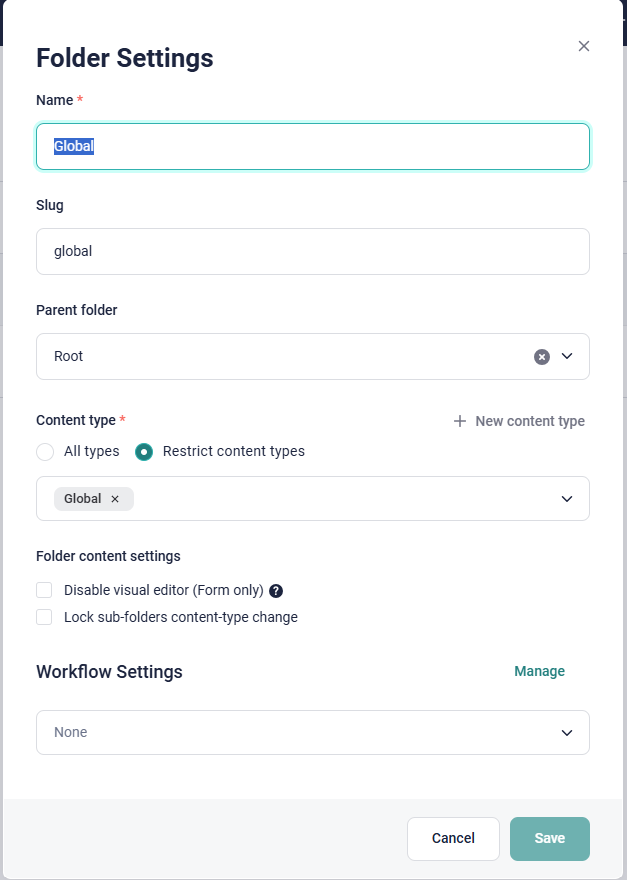
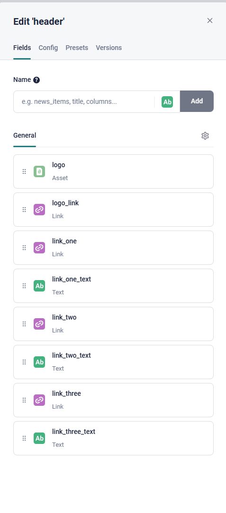
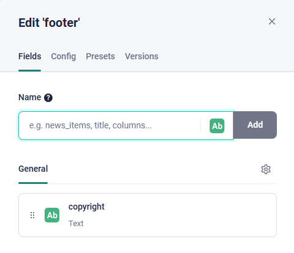
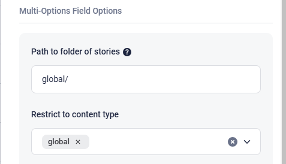

## Instructions for the Initial Project Installation

### Create a New Repo with the Template

1. **Click on the button "Use this template"**

    

2. **Enter the details for your project.**

    Preferably don't choose "Include all branched" as the main branch is stable and should be used as a template for creation.

    

3. Now you should have a new repo for your project initialised. This project has typescript, default components, eslint/prettier, tailwind and prepared code for Vercel and Storyblok, but if you try to run the project locally it will not work.
   Pay attantion that this project has not Storyblok or Vercel connections, no branches protection or CI/CD checks implemented.
   We will cover all these moment in the nxt steps.

### Connect Storyblok Space

1. **Connect Storyblok to the Github Project**

    Go to Storyblok settings in your project: Settings > Access token.
    Here you should from the beginning have a token with the Access level "Preview". If you dont have generate one for "Preview".

    

    Copy the token value and replace the example value of `NEXT_PUBLIC_STORYBLOK_ACCESS_TOKEN` in `.env` file.
    It will allow our project to have access to the Storyblok space and retrieve data.

### Set Up Default Components in Storyblok

The components in the code and in Storyblok are connected in the file `StoryblokProvider.tsx`.
So, to set up components correctly we will work both in `StoryblokProvider.tsx` file and in Storyblok space.

1. **Delete Initial Components**

    By default there are 4 components in Block library in Storyblok, we need to delete 3 of them, because they are not used in our set up:

    

    Page component should be kept as we will use is as a nestable component for every page.

2. **Create Simple Nestable Components**

    We need to create 2 Nestable components in Storyblok: Hero, Richtext Example.

    

    Go to Block Library and click the button "New Block".
    The first block should be called "hero" and have two fields inside: title (type Text) and text (type Textarea):

    

    The second block should be called "richtext_example" and have two fields inside: title (type Text) and text (type Richtext):

    

!PAY ATTANTION: Storyblok differentiates display name and technical name, so it is a better practive to type all the technical names lowercase, component names when you connect them in the code are case sensitive and usage of different cases with create a mess during the development.

3. **Create Global Components**

    3.1. Go to the Block Library menu and click on the New Block button in the top right corner. We want to create a new content type component called global. Add a new Blocks field in this component and call this field global too. Using a Blocks field offers maximum flexibility, allowing you to use whatever nestable component(s) you may need. The result should be like here:

    

    3.2. Create a new top-level folder called global in which all of our global components will be located. Furthermore, let's use the Restrict content types setting in the folder configuration to ensure that all stories created in this folder will be of the global content type:

    

    3.3. Create 2 Nestable blocks that will be responsible for header and footer in our project.
    Here is the setting for header:

    

    And the settings for footer:

    

    3.4. Inside global folder create 2 stories: header and footer. And insert the header block in the Header story and the footer block in the Footer story.

    3.5. Go to the Block Library menu and click on the New Block button. Create a new nestable component with the technical name `global_reference`. Then add a new field of the type References and name it `reference`.
    In the field configuration enter `global/` in Path to folder of stories. Also restrict the content type to `global`:

    

    This step is required for technical needs in the codebase. The goal is to retireve header and footer as the global references for every page and not only as a separate stories.
