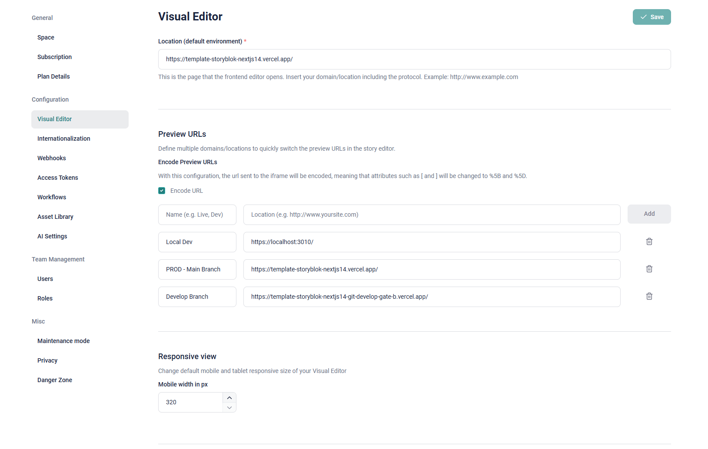
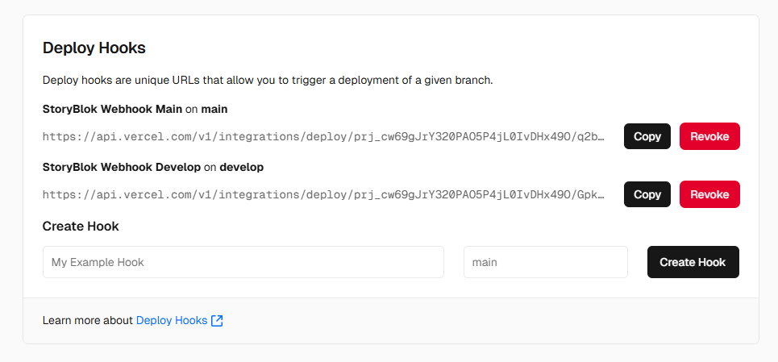

## Vercel Set Up

### Installation

In order to work on this repository on your local machine, follow these steps:

1. **Create Project in Vercel**  
   Choose the correct team where you would like to have the project and click "Create Project"
   

2. **Import Github Repo**  
   Import the Github Repo that will be connected to the Vercel deployments.
   On the next step type the Project Name and choose deploy. Root Directory and Framework Preset will be prefilled, so usually no additinal settings are required.
   

3. **Deployment Running**  
   When the project build is deployed you will receive the "Congratulations" message.
   If `npm run build` is failed you will have to fix the problems to see the preview.
   The next step would be to click "Continue to Dashboad".
   Congratulations! Our vercel deployments from Github are set up. Now every push will cause a deployment in Vercel and you will be able to preview the changes.

4. **Vercel Settings for Storyblok Preview**  
   To enable Storyblok access to the different branches in Vercel you should go to Project Dashboard > Settings > Deployment Protection > Vercel Authentication and disable the switcher:
   
   Then go to Project Dashboard > Settings > Domains. Here you will see the main domain present by default. To enable 1 or more develop previews accessable via Storyblok add them as separate domains. The link to add you can find in deployments. If the branch was ever deployed in Vercel it has a domain assigned by Vercel.
   The suggestion will be to add 1 domain in settings for develop branch as a Preview:
   

5. **Set up Previews in Storyblok**  
   Go to the Storyblok admin panel: Settings > Visual Editor.
   Here you have to set up visual editor links for you project. Base requirements will be covered by 3 links:
   Local Dev - https://localhost:3010/ - the preview for local build for developers.
   Main Branch - YOUR_LINK_TO_VERCEL_MAIN_BRANCH_DEPLOYMENT - the preview for main stable branch and production site (if the site is live), for managers' and content editors' usage.
   Develop Branch - YOUR_LINK_TO_VERCEL_DEVELOP_BRANCH_DEPLOYMENT - the preview for develop branch, should be used for testing features before pushing them to production.
   

6. **Add Webhooks in Storyblok**  
   In order to call a deployment every time we update a story in Storyblok we need to add Vercel webhooks.
   The initial set up will include two branches: develop and main.
   Go to the Vercel Project Dashboard > Settings > Git > Deploy Hooks.
   Then write a title for your hook (i.e. StoryBlok Wrbhook Main) and choose the branch where this hook should work.
   
   Go to Storyblok Admin Panel > Settings > Webhooks and add the required webhooks with the endpoints that you have in previously added Vercel delpoy hooks:
   
